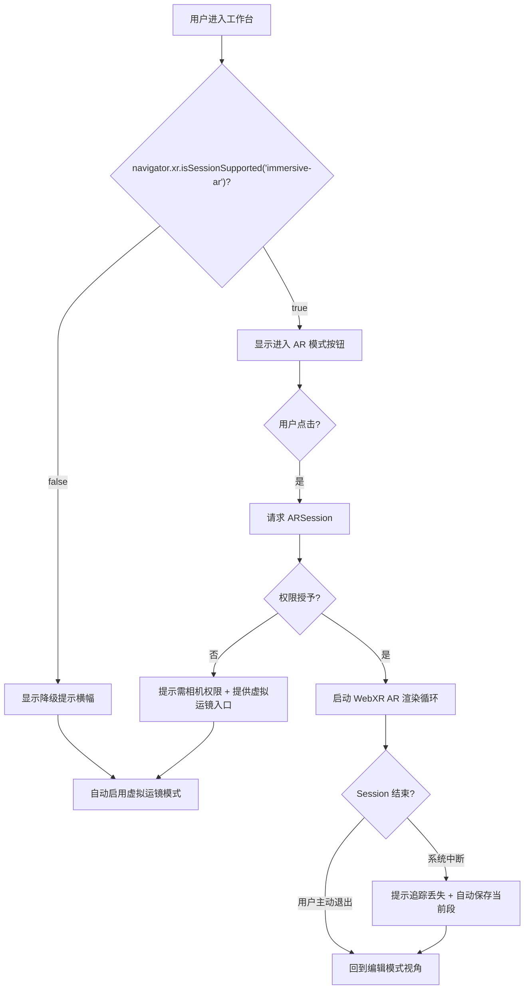
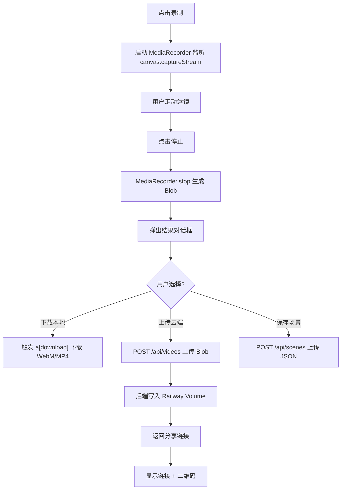

# Film space Web — 产品需求文档（PRD）

## 1. 产品概述

**Film space Web** 是 iOS 原生项目 [film-space](../../README.md) 的网页版改造，把"3D 场景调度 + ARKit 物理运镜"工作流搬到浏览器。目标用户使用安卓（OPPO Find 9 Ultra，支持 ARCore）通过 WebXR AR 获得与 iOS 版等价的"物理走动 → 虚拟相机运动"体验；桌面/iOS 用户自动降级为"虚拟运镜"模式。录制结果既可本地下载，也可上传到 Railway 后端生成分享链接，作为 Seedance 2.0 等 AI 风格迁移工具的相机参考素材。

- **解决问题**：让无 iPhone 的 AI 视频创作者也能用网页完成场景调度与运镜参考录制
- **目标用户**：使用 Seedance 2.0 / Sora / Runway 等 AI 视频工具的创作者，特别是安卓用户
- **市场价值**：原 iOS 版受设备限制，网页版可覆盖安卓 + 桌面双端，并通过分享链接形成社区传播

## 2. 核心功能

### 2.1 用户角色

| 角色 | 注册方式 | 核心权限 |
|------|---------|---------|
| 访客 | 无需注册 | 进入工作台、编辑场景、本地录制下载 |
| 创建者 | 本地存储 ID（自动生成） | 上述全部 + 上传场景/视频到云端、生成分享链接 |
| 浏览者 | 通过分享链接进入 | 只读查看场景配置、预览视频、复制 JSON 到自己工作台 |

### 2.2 功能模块

1. **工作台**（核心页）：3D 虚拟工作室 + 编辑/Camera 双模式切换 + 工具栏 + 录制
2. **场景库**：云端保存的场景列表，支持加载、分享、删除
3. **视频库**：云端录制的视频列表，支持在线预览、下载、分享

### 2.3 页面详情

| 页面名称 | 模块名称 | 功能描述 |
|---------|---------|---------|
| 工作台 | 3D 视口 | 棋盘格地板 + 网格 + 三色坐标轴 + 双方向光照明的虚拟工作室 |
| 工作台 | 模式切换 | Edit / Camera 双模式胶囊按钮，状态切换时相机姿态无缝衔接 |
| 工作台 | 编辑工具栏（左） | 旋转左/右（长按）、添加人形、删除选中 |
| 工作台 | 编辑工具栏（右） | 升降取景、虚拟摇杆、锁定视角、返回锁定 |
| 工作台 | Camera 工具栏（左） | 焦段循环按钮（35/50/75/200mm） |
| 工作台 | Camera 工具栏（右） | 肩高放置、锁定、录制（开始/停止）、返回 |
| 工作台 | AR 入口 | 检测到 WebXR AR 支持时显示"进入 AR 模式"按钮，点击请求权限 |
| 工作台 | 录制状态条 | 显示录制时长、实时帧率、磁盘占用估算，停止后弹出下载/上传选择 |
| 工作台 | 降级提示 | 不支持 WebXR AR 时显示提示横幅，自动启用虚拟运镜 |
| 场景库 | 场景列表 | 卡片式列表，缩略图 + 名称 + 更新时间 + 操作按钮 |
| 场景库 | 场景详情/加载 | 点击卡片把场景配置载入工作台 |
| 场景库 | 分享对话框 | 生成只读链接，可复制，含二维码（方便手机扫一扫在桌面打开） |
| 视频库 | 视频列表 | 卡片式列表，缩略图 + 时长 + 文件大小 + 操作按钮 |
| 视频库 | 视频预览 | 内嵌播放器，支持下载 MP4/WebM |
| 视频库 | 分享对话框 | 生成只读链接，可复制 |

## 3. 核心流程

### 3.1 工作台主流程

用户打开工作台 → 默认 Edit 模式 → 在 3D 视口里布置人物站位 → 切换到 Camera 模式 → 选择"进入 AR"（安卓 Chrome）或"虚拟运镜"（其他设备）→ 走动/拖动摇杆运镜 → 点击录制开始 → 走完整段运镜 → 点击停止 → 弹出"下载到本地 / 上传到云端"选择 → 完成后可保存场景配置到云端。

### 3.2 WebXR AR 检测与降级流程

### 3.3 录制与保存流程

## 4. 用户界面设计

### 4.1 设计风格

**美学方向**：电影级工业感 + 软影棚质感。参考 DaVinci Resolve、Cinema 4D 的暗色专业工具气质，但去除繁琐，保留 Apple Pro Apps 的克制。

- **主色**：深炭黑 `#0E0E10` 视口背景 / `#1A1A1E` 工具栏底色（与 iOS 版 `studioGrey = 0.22` 一致）
- **辅助色**：冷灰 `#2A2A2E` 卡片、`#3A3A3E` 边框、`#5A5A5E` 次级文字
- **强调色**：胶片橙 `#FF8A3D`（录制点 + 主 CTA），冷蓝 `#4A9EFF`（选中态）
- **状态色**：录制红 `#FF3B30`、成功绿 `#30D158`、警告黄 `#FFD60A`
- **按钮风格**：56px 圆形 + `backdrop-filter: blur(20px)` 玻璃材质（复刻 iOS 版 `.ultraThinMaterial`），1px 内边框 `rgba(255,255,255,0.15)`
- **字体**：显示字 `Space Mono`（等宽，呼应胶片时代的技术感）+ 正文 `IBM Plex Sans`（专业可读）+ 数字 `JetBrains Mono`
- **布局**：底部浮动工具栏（与 iOS 版一致），3D 视口全屏铺满，顶部仅录制状态条
- **图标**：Lucide Icons（线性、与 iOS 版 SF Symbols 风格匹配）

### 4.2 页面设计概览

| 页面名称 | 模块名称 | UI 元素 |
|---------|---------|---------|
| 工作台 | 3D 视口 | 全屏 canvas，深炭黑背景，棋盘格地板延伸至雾化边缘 |
| 工作台 | 顶部状态条 | 透明渐变黑底，左：模式徽章；中：录制时长（红色圆点闪烁 + `00:23.4`）；右：FPS + 模式切换 |
| 工作台 | 底部工具栏 | 居中浮动胶囊，玻璃材质；左右两组按钮，中间模式切换 |
| 工作台 | AR 入口卡片 | 检测到 AR 支持时从顶部下滑出现，橙色 CTA + 解释文案 |
| 工作台 | 录制结果弹窗 | 居中卡片，视频缩略图 + 时长 + 三个 CTA（下载 / 上传 / 丢弃） |
| 场景库 | 顶部导航 | 极简胶囊 tab：工作台 / 场景库 / 视频库 |
| 场景库 | 卡片网格 | 2 列卡片，3D 缩略图（截图）+ 名称 + 时间，hover 时浮起 + 显示操作按钮 |
| 场景库 | 分享弹窗 | 居中卡片，大号链接输入框 + 复制按钮 + 二维码画布 |
| 视频库 | 卡片网格 | 同场景库，缩略图为视频首帧 |
| 视频库 | 预览弹窗 | 居中模态，内嵌 `<video controls>` + 下载按钮 + 分享按钮 |

### 4.3 响应式

- **桌面优先**：工作台在桌面 1280×720+ 上有完整体验（鼠标轨道相机 + 键盘 WASD 虚拟运镜）
- **平板自适应**：iPad 横屏自动启用触摸手势（拖拽 + 捏合），与 iOS 版手势完全一致
- **手机横屏**：安卓/iPhone 横屏时工具栏压缩到 80% 缩放，按钮间距减半；自动检测 WebXR AR 能力
- **触控优化**：所有按钮最小 44×44pt 命中区；摇杆在触屏上启用触觉反馈（`navigator.vibrate(10)`）

### 4.4 3D 场景指引

- **环境**：纯色背景 `#1A1A1E`（不使用 HDRI，与 iOS 版 `.color(studioGrey)` 一致），无天空盒
- **灯光**：方向键光强度 1200 + 方向补光 400（与 iOS 版 `addLighting` 一致），无环境光（保持电影感对比）
- **相机**：初始位置 `azimuth=0.6, elevation=0.35, distance=6, target=[0,0.8,0]`（与 iOS 版 OrbitCameraController 默认值一致）
- **构图**：棋盘格 20×20 网格，每格 1m，向远处淡出到背景色（用 Fog `#1A1A1E` 起始 8m 终止 18m）
- **交互**：轨道相机 0.005 弧度/像素灵敏度（与 iOS 版一致），捏合缩放 1.5×~20× 限制
- **后处理**：轻微 SSAO（增强人形立体感）+ 颗粒噪点（`film-grain` 0.04 强度，模拟胶片质感）
- **资产**：人形替身用 Three.js 内置 BoxGeometry/SphereGeometry 程序生成（无外部模型文件），与 iOS 版 HumanFigureFactory 1:1 对齐尺寸

## 5. 性能预算

- **首屏**：≤ 2.5s（Vite 静态资源 + Three.js tree-shaking）
- **Bundle 体积**：≤ 400KB gzipped（Three.js ~150KB + 业务代码 ~100KB + 字体子集）
- **3D 帧率**：编辑模式 60fps，AR 模式跟随 XRSession（60Hz）
- **录制帧率**：30fps（与 iOS 版 `preferredFramesPerSecond = 30` 一致）
- **录制分辨率**：长边 1280px（与 iOS 版 `maxLongSide = 1280` 一致）
- **上传大小**：单视频 ≤ 50MB（约 60s 时长）

## 6. 约束与依赖

### 6.1 平台约束

- **WebXR AR 支持矩阵**：
  - ✅ Chrome on Android（自 Chrome 81，OPPO Find 9 Ultra 满足）
  - ✅ Samsung Internet
  - ❌ iOS Safari（不支持，自动降级）
  - ❌ Firefox for Android（不支持，自动降级）
  - ❌ 桌面浏览器（不支持 AR 模式，提供虚拟运镜替代）
- **必须 HTTPS**（WebXR 强制要求，Railway 默认提供）
- **必须横屏**（与 iOS 版一致，移动端强制 `screen.orientation.lock('landscape')`，失败则提示用户旋转）

### 6.2 外部依赖

- **ARCore**：OPPO Find 9 Ultra 通过 Google Play Services for AR 提供（首次使用网页会自动引导安装）
- **后端存储**：Railway Volume（注意 Volume 在服务重启后保留，但重新部署可能清空 —— 长期需迁移到对象存储如 Cloudflare R2）
- **无需外部 API 密钥**：所有功能本地 + 自有后端完成

## 7. 非功能性需求

- **可访问性**：键盘可完成所有编辑操作（WASD 运镜、Tab 切换按钮、Enter 确认）；色盲友好（选中态除蓝色外加边框加粗）
- **国际化**：MVP 中文优先，预留 i18n key 结构
- **错误处理**：AR session 中断时自动保存当前录制段；上传失败时本地保留 Blob 可重试
- **隐私**：所有场景数据存储在用户本地 + 用户私有 Railway Volume，无第三方分析
