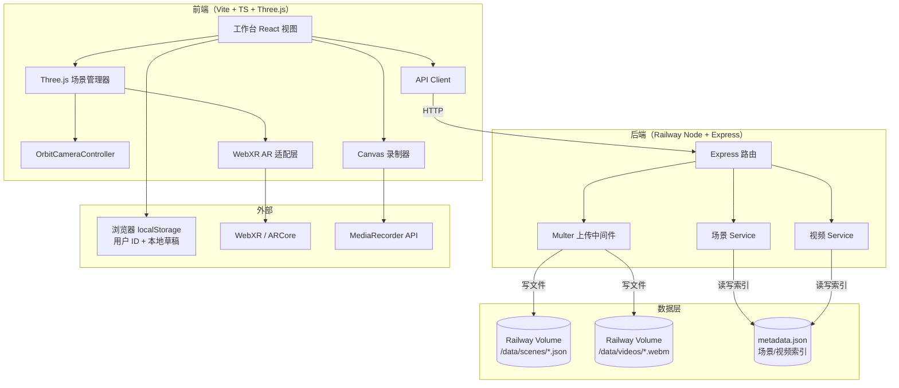
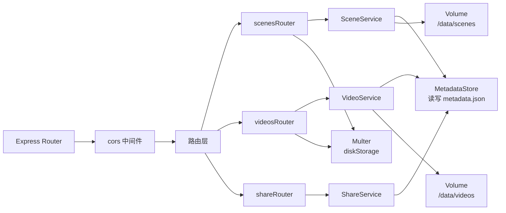
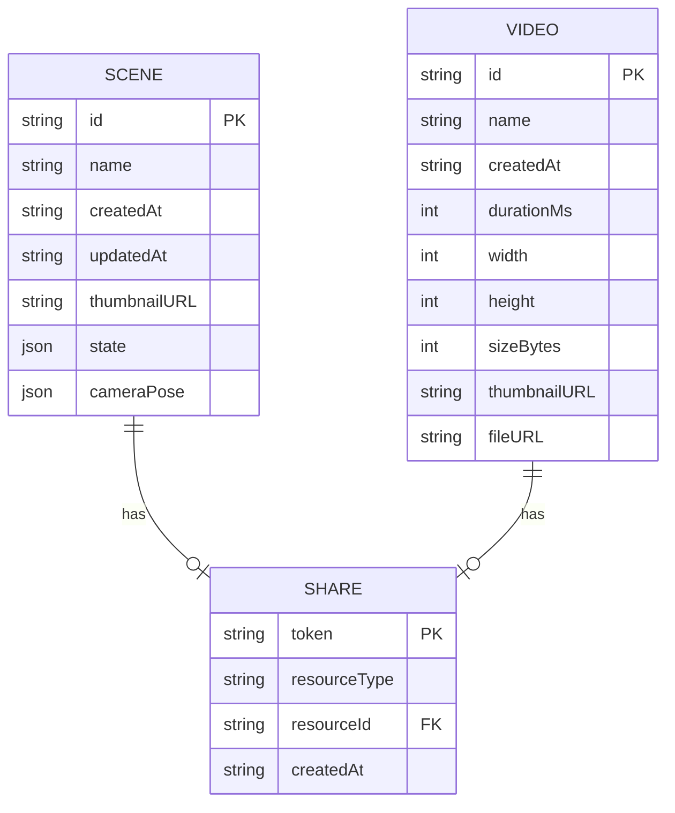
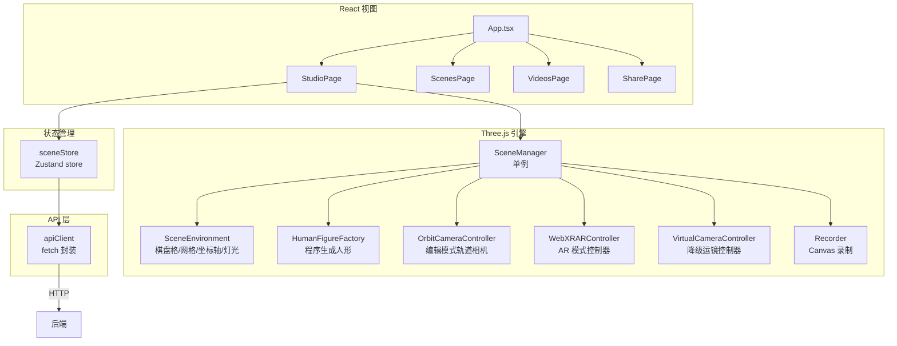
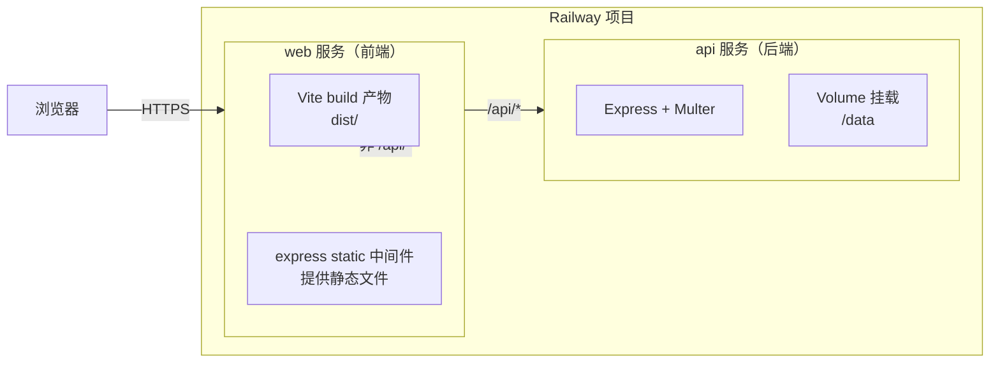

# Film space Web — 技术架构文档

## 1. 架构设计



## 2. 技术说明

- **前端**：React 18 + TypeScript 5 + Vite 5 + Tailwind CSS 3
  - 不使用 R3F（React Three Fiber）：WebXR API 调用较底层，直接用 Three.js 更可控；React 只负责 UI 层
  - Three.js 版本：r160+（含完整 WebXR 支持）
- **初始化工具**：`npm create vite@latest film-space-web -- --template react-ts`
- **后端**：Express 4 + Multer（文件上传）+ TypeScript
- **数据库**：无独立数据库，用 Railway Volume + 单个 `metadata.json` 索引文件（MVP 足够，场景/视频数量预期 < 1000）
- **部署**：Railway 双服务（前端静态 + 后端 Node），用 `railway.toml` 配置
- **共享类型**：前端 `src/types/api.ts` 与后端 `src/types/api.ts` 保持手写同步（MVP 不引入 monorepo 工具）

## 3. 路由定义

### 3.1 前端路由（React Router）

| 路由 | 用途 |
|------|------|
| `/` | 重定向到 `/studio` |
| `/studio` | 工作台主页（编辑 + Camera 双模式） |
| `/scenes` | 场景库列表 |
| `/scenes/:id` | 场景详情查看（只读，可载入工作台） |
| `/videos` | 视频库列表 |
| `/videos/:id` | 视频预览页（内嵌播放器） |
| `/share/scene/:token` | 公开分享的场景查看（无需登录） |
| `/share/video/:token` | 公开分享的视频查看 |

### 3.2 后端路由

| 路由 | 用途 |
|------|------|
| `GET /` | 健康检查 |
| `GET /api/scenes` | 列出所有场景元数据 |
| `GET /api/scenes/:id` | 获取单个场景 JSON |
| `POST /api/scenes` | 上传新场景（multipart：json + 缩略图） |
| `DELETE /api/scenes/:id` | 删除场景 |
| `GET /api/videos` | 列出所有视频元数据 |
| `GET /api/videos/:id` | 获取视频元数据 |
| `GET /api/videos/:id/file` | 下载/流式播放视频文件（支持 Range） |
| `POST /api/videos` | 上传新视频（multipart：webm + 元数据） |
| `DELETE /api/videos/:id` | 删除视频 |
| `GET /api/share/scene/:token` | 公开分享的场景查询 |
| `GET /api/share/video/:token` | 公开分享的视频查询 |

## 4. API 定义

### 4.1 共享类型（前后端同步）

```typescript
// 类型：src/types/api.ts

export type AppMode = 'edit' | 'camera';
export type FocalLength = 35 | 50 | 75 | 200;

export interface HumanPlacement {
  id: string;            // UUID v4
  position: [number, number, number];  // [x, y, z]
  rotationY: number;
}

export interface SceneState {
  mode: AppMode;
  humans: HumanPlacement[];
  selectedHumanID: string | null;
  focalLength: FocalLength;
  isRecording: boolean;
}

export interface OrbitCameraPose {
  azimuth: number;
  elevation: number;
  distance: number;
  target: [number, number, number];
}

export interface SceneMeta {
  id: string;            // UUID v4
  name: string;
  createdAt: string;     // ISO 8601
  updatedAt: string;
  thumbnailURL: string;  // 相对路径 /api/scenes/:id/thumbnail
  state: SceneState;
  cameraPose: OrbitCameraPose;
  shareToken?: string;
}

export interface VideoMeta {
  id: string;
  name: string;
  createdAt: string;
  durationMs: number;
  width: number;
  height: number;
  sizeBytes: number;
  thumbnailURL: string;
  fileURL: string;       // /api/videos/:id/file
  shareToken?: string;
}

export interface APIError {
  error: string;
  code: string;
}
```

### 4.2 请求/响应示例

```typescript
// POST /api/scenes
// Request: multipart/form-data
//   - json: SceneState + cameraPose (JSON string)
//   - thumbnail: image/png
//   - name: string
// Response 201: { id: string, shareToken: string }

// GET /api/scenes
// Response 200: { scenes: SceneMeta[] }

// POST /api/videos
// Request: multipart/form-data
//   - video: video/webm
//   - meta: VideoMeta (JSON string, 不含 id/fileURL)
// Response 201: { id: string, fileURL: string, shareToken: string }

// GET /api/videos/:id/file
// Response 200: video/webm, supports Range header for streaming
```

## 5. 服务端架构图



### 5.1 关键模块职责

- **MetadataStore**：单例类，负责读写 `/data/metadata.json`（场景与视频的索引），用 `async-mutex` 保证并发安全
- **SceneService**：场景 CRUD，写入 `/data/scenes/:id.json` + `/data/scenes/:id.png`（缩略图）
- **VideoService**：视频 CRUD，写入 `/data/videos/:id.webm` + `/data/videos/:id.png`（首帧缩略图）
- **ShareService**：生成 `crypto.randomUUID()` 作为分享 token，写入 metadata 索引

## 6. 数据模型

### 6.1 文件系统结构（Railway Volume）

```
/data/
├── metadata.json              # 全局索引
├── scenes/
│   ├── {uuid}.json            # SceneState + OrbitCameraPose
│   └── {uuid}.png             # 缩略图
└── videos/
    ├── {uuid}.webm            # 视频文件
    └── {uuid}.png             # 首帧缩略图
```

### 6.2 metadata.json 结构（ER 概念）



### 6.3 metadata.json DDL（JSON Schema 形式）

```json
{
  "scenes": [
    {
      "id": "uuid-v4",
      "name": "示例场景",
      "createdAt": "2026-07-01T12:00:00.000Z",
      "updatedAt": "2026-07-01T12:30:00.000Z",
      "thumbnailURL": "/api/scenes/uuid/thumbnail",
      "state": { "mode": "edit", "humans": [], "selectedHumanID": null, "focalLength": 35, "isRecording": false },
      "cameraPose": { "azimuth": 0.6, "elevation": 0.35, "distance": 6, "target": [0, 0.8, 0] },
      "shareToken": "uuid-v4"
    }
  ],
  "videos": [
    {
      "id": "uuid-v4",
      "name": "运镜参考 001",
      "createdAt": "2026-07-01T12:35:00.000Z",
      "durationMs": 23400,
      "width": 1280,
      "height": 720,
      "sizeBytes": 8388608,
      "thumbnailURL": "/api/videos/uuid/thumbnail",
      "fileURL": "/api/videos/uuid/file",
      "shareToken": "uuid-v4"
    }
  ]
}
```

## 7. 前端模块架构



### 7.1 关键类设计

#### SceneManager（Three.js 引擎入口）

```typescript
class SceneManager {
  private renderer: THREE.WebGLRenderer;
  private scene: THREE.Scene;
  private camera: THREE.PerspectiveCamera;
  private orbitController: OrbitCameraController;
  private arController: WebXRARController;
  private virtualController: VirtualCameraController;
  private recorder: Recorder;
  private currentMode: AppMode;

  init(canvas: HTMLCanvasElement): void;
  setMode(mode: AppMode): Promise<void>;  // Camera 模式异步进入 AR
  addHuman(): void;
  selectHuman(id: string | null): void;
  setFocalLength(f: FocalLength): void;
  startRecording(): void;
  stopRecording(): Promise<Blob>;
  dispose(): void;
}
```

#### WebXRARController（复刻 iOS ARCameraView 逻辑）

```typescript
class WebXRARController {
  private session: XRSession | null = null;
  private referenceSpace: XRReferenceSpace | null = null;
  private editCameraTransform: THREE.Matrix4;  // 进入 AR 时的初始姿态
  private referenceTransform: THREE.Matrix4;   // 进入 AR 时的设备姿态
  private pendingRecenter = false;
  private pendingShoulderPlacement = false;

  async isSupported(): Promise<boolean>;
  async enter(renderer: THREE.WebGLRenderer, initPose: THREE.Matrix4): Promise<void>;
  onFrame(frame: XRFrame, camera: THREE.PerspectiveCamera): void;
  // 复刻 iOS applyDeviceMotion: deltaRotation + worldDelta + yawAlign
  requestRecenter(): void;
  requestShoulderPlacement(): void;
  exit(): Promise<void>;
}
```

#### Recorder（Canvas 录制）

```typescript
class Recorder {
  private mediaRecorder: MediaRecorder | null = null;
  private chunks: Blob[] = [];
  private stream: MediaStream;

  start(canvas: HTMLCanvasElement, fps = 30): void;
  stop(): Promise<Blob>;  // 返回 webm Blob
  getDurationMs(): number;
}
```

## 8. 部署架构

### 8.1 Railway 服务拓扑



### 8.2 关键配置文件

#### `railway.toml`（前端）

```toml
[build]
builder = "nixpacks"

[deploy]
startCommand = "npm run serve"
healthcheckPath = "/"
healthcheckTimeout = 30
```

#### `railway.toml`（后端）

```toml
[build]
builder = "nixpacks"

[deploy]
startCommand = "npm start"
healthcheckPath = "/api/health"
healthcheckTimeout = 30

[[deploy.volume]]
source = "data"
destination = "/data"
```

### 8.3 环境变量

| 变量名 | 服务 | 说明 |
|--------|------|------|
| `PORT` | 前后端 | Railway 自动注入 |
| `API_BASE_URL` | 前端 | 后端服务 URL，默认 `/api`（同源代理） |
| `VOLUME_PATH` | 后端 | 默认 `/data`，本地开发用 `./data` |
| `MAX_UPLOAD_MB` | 后端 | 默认 50，限制单文件上传大小 |

## 9. 开发流程

### 9.1 目录结构

```
film-space/
├── web/                          # 前端项目
│   ├── src/
│   │   ├── components/
│   │   │   ├── Studio/
│   │   │   │   ├── StudioCanvas.tsx
│   │   │   │   ├── StudioToolbar.tsx
│   │   │   │   ├── ARPrompt.tsx
│   │   │   │   └── RecordingBar.tsx
│   │   │   ├── Scenes/
│   │   │   └── Videos/
│   │   ├── engine/
│   │   │   ├── SceneManager.ts
│   │   │   ├── SceneEnvironment.ts
│   │   │   ├── HumanFigureFactory.ts
│   │   │   ├── OrbitCameraController.ts
│   │   │   ├── WebXRARController.ts
│   │   │   ├── VirtualCameraController.ts
│   │   │   └── Recorder.ts
│   │   ├── store/
│   │   │   └── sceneStore.ts
│   │   ├── api/
│   │   │   └── client.ts
│   │   ├── types/
│   │   │   └── api.ts
│   │   └── pages/
│   │       ├── StudioPage.tsx
│   │       ├── ScenesPage.tsx
│   │       ├── VideosPage.tsx
│   │       └── SharePage.tsx
│   ├── public/
│   ├── index.html
│   ├── vite.config.ts
│   ├── tailwind.config.ts
│   └── package.json
├── server/                       # 后端项目
│   ├── src/
│   │   ├── routes/
│   │   │   ├── scenes.ts
│   │   │   ├── videos.ts
│   │   │   └── share.ts
│   │   ├── services/
│   │   │   ├── MetadataStore.ts
│   │   │   ├── SceneService.ts
│   │   │   ├── VideoService.ts
│   │   │   └── ShareService.ts
│   │   ├── middleware/
│   │   │   └── upload.ts
│   │   ├── types/
│   │   │   └── api.ts
│   │   └── index.ts
│   ├── tsconfig.json
│   └── package.json
├── .trae/documents/
├── railway.toml
└── README.md
```

### 9.2 本地开发

- 前端：`cd web && npm run dev` → http://localhost:5173
- 后端：`cd server && npm run dev` → http://localhost:3001
- 前端 `vite.config.ts` 配置 `/api` 代理到 `http://localhost:3001`
- WebXR 必须在 HTTPS 下测试：本地用 `vite --host` + `mkcert` 生成证书，手机访问 `https://<局域网IP>:5173`

### 9.3 真机调试技巧

- Chrome on Android → `chrome://inspect` → 远程调试
- WebXR 模拟器扩展（仅测逻辑，不测真实追踪质量）
- OPPO Find 9 Ultra 首次使用前在系统设置确认"Google Play Services for AR"已安装
